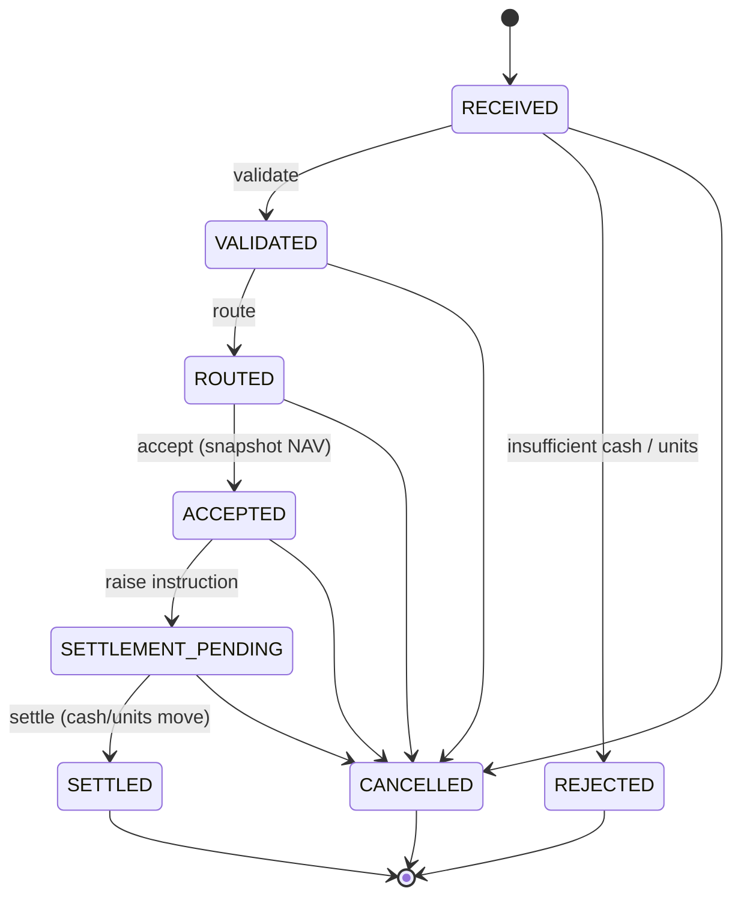
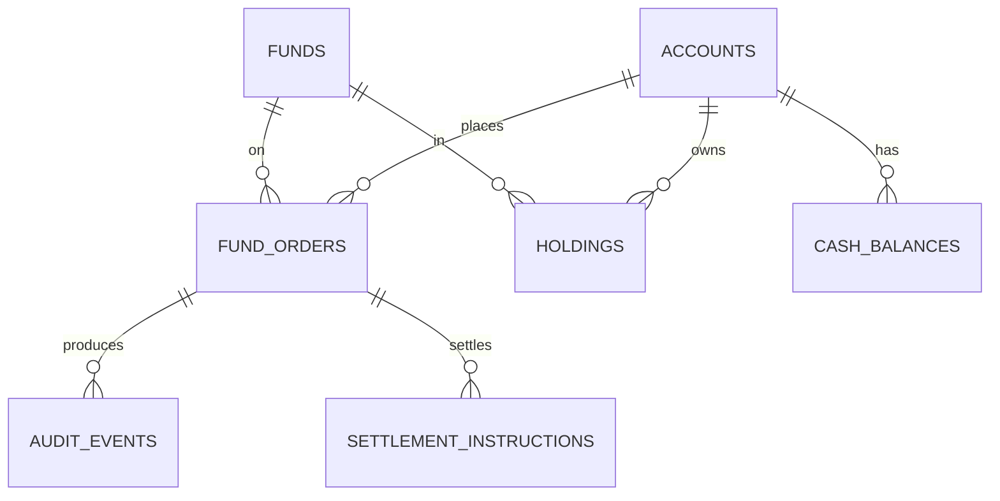

# ClearFund — Investment Fund Order Routing & Custody Simulator

A Java 21 / Spring Boot 3 backend that **simulates** subscription and
redemption orders for investment funds: order routing through a strict
lifecycle state machine, NAV-based pricing, T+2 settlement simulation,
custody holdings, cash balances, full audit logging, and a mock SWIFT-style
message intake. A minimal Angular 17 dashboard ships alongside it.

> **Educational portfolio project.** No real trading, no real SWIFT/ISO 20022
> integration, no real NAV feed. Every "external" interaction is simulated so
> the focus stays on backend engineering quality.

## Why I built this

I wanted a portfolio project that mirrors the *kind* of work I'd do as a
graduate / early-career engineer at a financial services firm: a transactional
back-office service with a clear domain model, real database migrations, an
auditable lifecycle, settlement logic that has to be rollback-safe, and the
DevOps wrapping (Docker, Jenkins, Linux scripts) that production code lives
inside. The domain (fund orders + custody) is realistic enough to be
non-trivial without requiring me to model anything I haven't actually worked
with.

It is deliberately small in scope and explicit about its non-goals — what
matters is the engineering, not the simulation.

## Key features

- **Order lifecycle state machine** with eight states and explicit, enum-encoded transitions; every transition writes an immutable audit row.
- **NAV pricing**: `units = cash / NAV` for subscriptions, `cash = units × NAV` for redemptions, with `BigDecimal` rounding.
- **Rollback-safe settlement** inside a single `@Transactional` boundary; pre-validates sufficiency before mutating, so a failed settlement has zero side effects.
- **REST API** (`/api/orders`, `/api/accounts/{id}/holdings`, `/api/accounts/{id}/cash-balances`, `/api/system/health-summary`, …) with pagination, filtering, consistent error envelope (404 / 409 / 422), and DTOs at the boundary.
- **Mock SWIFT-style message intake** — a small, forgiving parser for a 5-field subset of an ISO 15022-style securities message, exposed as `POST /api/messages/parse` and `POST /api/messages/create-order`.
- **Flyway migrations** (`V1` schema, `V2` seed data, `V3` performance indexes) written in PostgreSQL with Oracle-compatible syntax and inline `-- Oracle:` notes.
- **48 tests** across unit, web slice (`@WebMvcTest` + MockMvc) and an end-to-end Testcontainers test against real PostgreSQL.
- **DevOps**: multi-stage Dockerfile (non-root), Docker Compose with a healthcheck-gated backend, Jenkinsfile, and Bash + PowerShell run scripts.
- **Angular 17 dashboard** (standalone components) for an operator view on top of the API.

## Tech stack

| Area | Choice |
|---|---|
| Language / runtime | Java 21 |
| Framework | Spring Boot 3.3 (Web, Data JPA, Validation) |
| Database | PostgreSQL 16 (local) — DDL written to be Oracle-compatible |
| Migrations | Flyway 10 |
| Build | Maven 3.9 |
| Testing | JUnit 5, Mockito, MockMvc, Testcontainers, AssertJ |
| DevOps | Docker, Docker Compose, Jenkins (declarative) |
| Frontend | Angular 17 (TypeScript, standalone components, reactive forms) |
| Scripts | Bash + PowerShell (cross-platform local dev) |

## Architecture overview

Classic layered design under `com.clearfund`:

```
controller → service → repository → entity
              │
              ├── audit/        single AuditService writes the trail
              ├── mapper/       entity ↔ DTO
              ├── dto/          request/response records
              ├── exception/    custom + @RestControllerAdvice
              ├── enums/        OrderStatus state machine, OrderType
              └── config/       JPA auditing, settlement properties
```

Key decisions worth defending in an interview:

- **DTOs at the boundary** — entities never leave the service layer.
- **Service owns transactions**; controllers are thin.
- **State-machine rules live on the enum** (`OrderStatus.canTransitionTo`) so every service uses the same source of truth.
- **`SettlementService` owns money movement** so settlement is one rollback-safe transactional unit, not spread across the order service.
- **`ddl-auto: validate` + Flyway** — Hibernate verifies the mapping against the migrated schema and refuses to start on drift.

## Order lifecycle



Every transition writes a row to `audit_events`. Rejections store a reason
(insufficient cash / holdings); cancellations store the caller's reason.

## Database schema (overview)



Seven tables: `funds`, `accounts`, `cash_balances`, `holdings`, `fund_orders`,
`audit_events`, `settlement_instructions`. Optimistic locking (`@Version`) on
`cash_balances` and `holdings`. `audit_events` deliberately has no FK to
`fund_orders` so the trail is immutable and survives archiving. Indexes
declared in `V3` are each justified against the exact repository query they
serve.

Full DDL: [`src/main/resources/db/migration/`](src/main/resources/db/migration/).

## API examples

```bash
# Place a subscription
curl -X POST http://localhost:8080/api/orders \
  -H 'Content-Type: application/json' \
  -d '{ "accountRef": "ACC-1002", "fundCode": "LU0292096186",
        "orderType": "SUBSCRIPTION", "cashAmount": 2000.00 }'

# Drive the lifecycle
curl -X POST http://localhost:8080/api/orders/42/validate
curl -X POST http://localhost:8080/api/orders/42/route
curl -X POST http://localhost:8080/api/orders/42/accept
curl -X POST http://localhost:8080/api/orders/42/settle

# Custody and cash for an account
curl http://localhost:8080/api/accounts/1/holdings
curl http://localhost:8080/api/accounts/1/cash-balances

# Operational snapshot
curl http://localhost:8080/api/system/health-summary
```

Errors share one envelope (HTTP 404 / 409 / 422). Full request/response
samples: [`docs/api-examples.md`](docs/api-examples.md).

## Screenshots

> _Add screenshots of the Angular dashboard (Order Book, Order Details, System
> Health) here once you have them. Suggested directory: `docs/screenshots/`._

## Testing

48 tests, all green, across four layers:

| Layer | Tests | Tooling |
|---|---|---|
| Pure unit (state machine, audit service, SWIFT parser) | 22 | JUnit 5, Mockito, AssertJ |
| Service logic (order lifecycle, settlement) | 16 | JUnit 5, Mockito |
| Web slice (`OrderController`, `SwiftMessageController`) | 9 | `@WebMvcTest` + MockMvc |
| End-to-end | 1 | `@SpringBootTest` + **Testcontainers (PostgreSQL)** |

The Testcontainers test runs Flyway against a real PostgreSQL and exercises
place → validate → route → accept → settle, asserting custody, cash, the
settlement instruction and the audit trail. It's annotated
`@Testcontainers(disabledWithoutDocker = true)` so it **skips, not fails** on
agents without Docker — and during development it earned its keep: it caught a
real bug (`SETTLEMENT_PENDING` = 18 chars overflowing a `VARCHAR(16)` status
column) that mock-based tests could never have surfaced.

Run the suite:
```bash
mvn test
scripts/run-tests.sh                                          # bash
scripts/run-tests.sh '-Dtest=!OrderLifecycleIntegrationTest'  # skip Docker test
```
Detail and "what I'd add in production": [`TESTING.md`](TESTING.md).

## CI/CD

[`Jenkinsfile`](Jenkinsfile) is a declarative pipeline with five stages:

1. **Checkout** — `checkout scm`
2. **Build** — `mvn -B -DskipTests clean compile` (fail fast on compile)
3. **Unit tests** — `mvn -B test`, results published via `junit`
4. **Static analysis** — placeholder stage; the exact command for
   SpotBugs / Checkstyle / SonarQube is in a comment, so wiring it in is a
   one-line change
5. **Package** — `mvn -B -DskipTests package`; jar archived with fingerprint

Pipeline options: `timestamps()`, 20-minute timeout, no concurrent builds.
The Testcontainers test self-skips on agents without Docker, so the pipeline
stays green on lightweight CI runners.

[`Dockerfile`](Dockerfile) is multi-stage (Maven build → slim
`temurin:21-jre`, **non-root user**, tunable `JAVA_OPTS`).
[`docker-compose.yml`](docker-compose.yml) starts PostgreSQL plus the backend
with the backend gated on the **db healthcheck** (`pg_isready`), avoiding the
classic "app starts before Postgres is ready" race.

## How to run locally

### Option A — full stack in Docker (zero local tooling beyond Docker)

```bash
scripts/run-local.sh            # build and start in the foreground
scripts/run-local.sh --detach   # background
# Windows: ./scripts/run-local.ps1
```

Backend on <http://localhost:8080>. Verify with:
```bash
curl http://localhost:8080/api/system/health-summary
```

### Option B — JVM on host + Postgres in Docker

Requires JDK 21 + Maven.
```bash
docker compose up -d db        # start the database
mvn spring-boot:run            # start the backend on :8080
```

### Frontend (optional)

```bash
cd frontend
npm install
npm start                      # Angular dev server on :4200
```
The dev server proxies `/api` → `:8080` (`proxy.conf.json`).

### Troubleshooting (most common)

| Symptom | Fix |
|---|---|
| `Connection to localhost:5432 refused` on backend startup | The DB isn't running. `docker compose up -d db`. |
| `Cannot connect to the Docker daemon` (macOS) | Docker Desktop isn't running. `open -a Docker`, wait for the whale icon. |
| Port 8080 / 5432 already in use | Stop the other process or change the host port mapping in `docker-compose.yml`. |
| Hibernate "schema-validation" failure | An entity drifted from a migration. Align the `@Column` with the `Vx` DDL — this is intentional (`ddl-auto: validate` catches drift early). |
| Angular page is blank | Make sure `zone.js` is in `polyfills` in `angular.json`; hard-refresh the browser. |

## What I learned

- Designing a strict order lifecycle as an **enum-driven state machine** so transitions and rollbacks have one source of truth, instead of `if/else` scattered across services.
- Writing **rollback-safe** transactional code: pre-validate before mutating, keep the whole settlement (cash + units + instruction + order + audit) in one `@Transactional` unit, and let RuntimeException trigger rollback.
- Making schema migrations the **owner of truth** with Flyway + `ddl-auto: validate`, so deployment fails loud on drift instead of corrupting data silently.
- Writing **Oracle-compatible SQL** from a PostgreSQL codebase (explicit sequences, `VARCHAR`/`NUMERIC`, no `IDENTITY`, careful `setval` vs `ALTER SEQUENCE RESTART`).
- Using **Testcontainers** to write the *one* high-value integration test that catches what unit tests can't — a real schema/migration/rollback path — and the Postgres-vs-mocks bug it caught during development is now a story I can tell in interviews.
- Building DevOps **discipline** even for a portfolio: non-root Docker images, healthcheck-gated startup, the Jenkins stages, environment-aware scripts, troubleshooting notes for the next person.
- Keeping clear **non-goals** documented (no real SWIFT, no real auth, no async settlement engine yet) — engineering judgement is showing what you chose *not* to build, and why.

## Future improvements

If I extended this beyond a portfolio project I would:

- Add **Spring Security + JWT** so accounts can only act on their own orders.
- Replace the synchronous `POST /settle` with a **scheduled settlement engine** (`@Scheduled` job using `findByStatusAndSettlementDateLessThanEqual`, already present on the repository).
- Add an **ISIN → fundCode resolver** instead of the current simplification of using ISIN directly as fund code in the SWIFT path.
- Expose **OpenAPI / Swagger UI** via springdoc-openapi.
- Add **observability**: Micrometer + Prometheus + a Grafana dashboard for order throughput, settlement queue depth, and audit volume.
- Introduce **event-driven** settlement (publish a `SettlementCompleted` domain event; downstreams listen).
- Wire **SpotBugs / Checkstyle / SonarQube** into the static-analysis pipeline stage that's currently a placeholder.
- Add **GitHub Actions** alongside the Jenkinsfile (most reviewers look for it).
- Run the test suite against **Oracle XE in Testcontainers** to prove the SQL is genuinely portable, not just claimed to be.
- Add the small backend change to expose **`id` on `OrderResponse`** so the Angular dashboard's per-order action buttons activate (a known frontend caveat documented in `frontend/README.md`).

---

## For my CV / LinkedIn

> **ClearFund — Investment Fund Order Routing & Custody Simulator**
> _Personal project · Java 21 · Spring Boot 3 · PostgreSQL · Flyway · Docker · Jenkins · Angular 17_
>
> Built a simulated back-office service for fund subscription and redemption
> orders: layered Spring Boot 3 REST API, a strict order-lifecycle state
> machine with full audit logging, NAV-priced settlement inside one
> rollback-safe `@Transactional` boundary, Flyway migrations written in
> Oracle-compatible PostgreSQL, and a mock SWIFT-style message parser.
> Covered by 48 tests across unit, MockMvc web slices and a Testcontainers
> end-to-end test that runs Flyway against real PostgreSQL — the integration
> test caught a real `VARCHAR` overflow bug during development that mocks
> could never have surfaced. Production-support thinking throughout:
> multi-stage non-root Dockerfile, healthcheck-gated `docker-compose`,
> declarative Jenkinsfile, and Bash / PowerShell run scripts. Minimal
> Angular 17 dashboard on top.
> Code: github.com/&lt;your-handle&gt;/clearfund

(One-liner version, ~280 chars, for LinkedIn skill / headline use:)

> Simulated fund order-routing and custody service in Java 21 / Spring Boot 3
> with a strict lifecycle state machine, rollback-safe settlement, Flyway
> migrations (Oracle-compatible PostgreSQL), 48 tests including a
> Testcontainers end-to-end suite, plus Docker / Jenkins / Linux-scripting
> wrapping.
